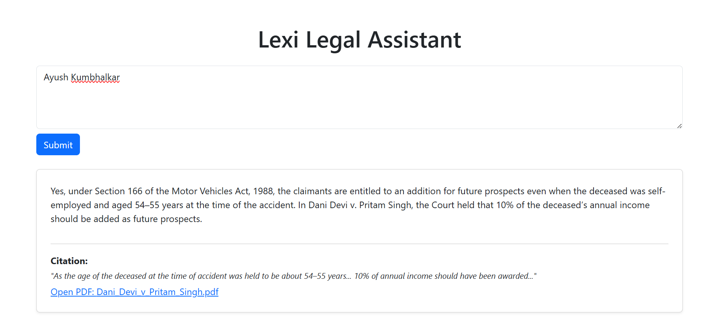

# Lexisg-Frontend-Intern-Test

This is a frontend assignment project for Lexi's internship/full stack developer role.  
The task simulates a legal assistant interface that accepts a query and returns an AI-generated answer with legal citations.

---

## 📌 Features

- Chat-style interface for legal queries
- Simulated API response using hardcoded data
- Displays legal answer + citation from case law
- Citation is clickable and opens a PDF in a new tab

---

## 🛠️ Tech Stack

- React.js
- Bootstrap 5 (via CDN)
- No backend – API simulated in frontend

---

## 🚀 How to Run Locally

1. Clone the repository:

```bash
git clone https://github.com/FrontendwithAyush/lexisg-frontend-intern-test.git
cd lexisg-frontend-intern-test
```

2. Install dependencies:

```bash
npm install
```

3. Start the app:

```bash
npm start
```

It will run at `http://localhost:3000`

---

## 🖼️ Screenshot




---

## 📄 Citation Handling

- Clicking the citation opens this PDF in a new tab:  
[Open PDF](https://lexisingapore-my.sharepoint.com/:b:/g/personal/harshit_lexi_sg/EdOegeiR_gdBvQxdyW4xE6oBCDgj5E4Bo5wjvhPHpqgIuQ?e=TEu4vz)

- Bonus features like scroll-to or highlight can be added in future with PDF.js or iframe embedding.

---

## ✅ Submission Info

**Repo Name:** `lexisg-frontend-intern-test`  
**Hosted Demo:** [https://lexi-test-frontend.netlify.app/](https://lexi-test-frontend.netlify.app/)  
**Developer:** Ayush Kumbhalkar

---

## 📬 Contact

If you have any questions, feel free to reach out at `ayushkumbhalkar68@email.com`.
